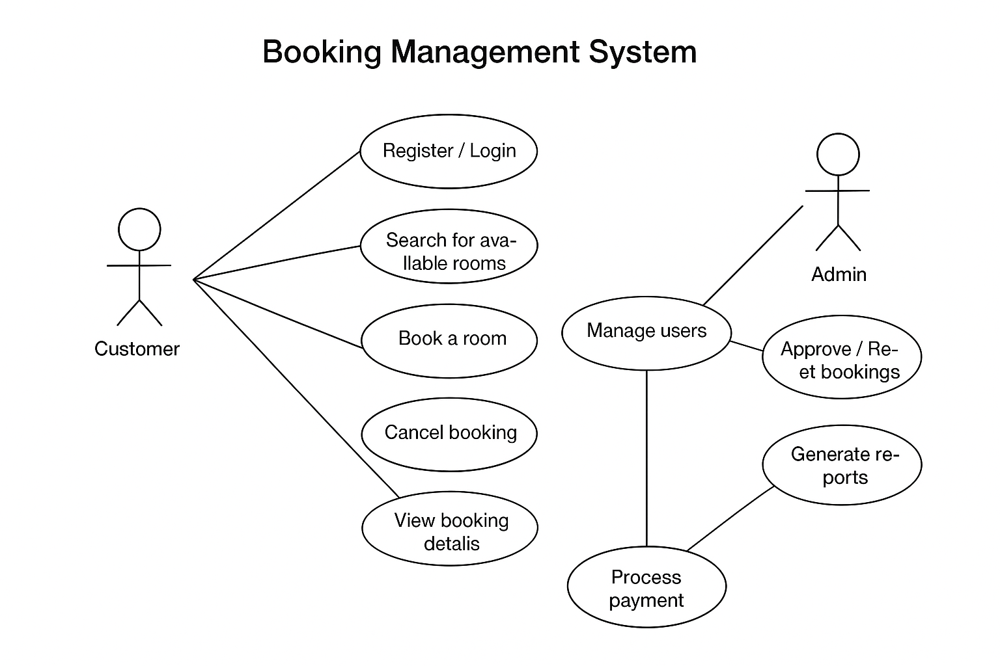

Requirement Analysis in Software Development. This repository explores SDLC contexts
🧩 What is Requirement Analysis?

Requirement Analysis is the process of identifying, gathering, and understanding the needs and expectations of stakeholders for a software system. It involves defining what the system should do — not how it will do it. This phase lays the foundation for every other stage in the Software Development Lifecycle (SDLC).

🔍 Detailed Explanation

During requirement analysis, software engineers, project managers, and clients collaborate to clearly define:

Functional requirements: The specific features and behaviors the system must have (e.g., user login, payment processing, data storage).

Non-functional requirements: The system’s performance characteristics such as security, scalability, usability, and reliability.

Constraints: Limitations related to technology, budget, or timelines.

This phase often includes activities like stakeholder interviews, document analysis, use case modeling, and the creation of Software Requirement Specifications (SRS).

🚀 Importance in the SDLC

Requirement Analysis is critical because it serves as the blueprint for the entire project. Getting this phase right ensures that the team builds the right product — one that meets user expectations and business goals.

Here’s why it’s so important:

Clarity and Understanding:
It ensures developers, designers, and stakeholders share a common understanding of what is being built.

Prevents Scope Creep:
Clearly defined requirements help prevent unnecessary changes or additions during development.

Improves Project Planning:
Accurate requirements allow for realistic timeframes, budgeting, and resource allocation.

Enhances Quality:
A system designed based on well-analyzed requirements is more likely to meet user needs and perform reliably.

Reduces Cost and Rework:
Detecting issues or misunderstandings early in the requirements phase saves time and money that would otherwise be spent fixing problems later.

🧠 In Summary

Requirement Analysis is the first and most essential step in building successful software. It bridges the gap between user needs and technical implementation, ensuring that every design and line of code contributes meaningfully toward solving the intended problem.
💡 Why is Requirement Analysis Important?

Requirement Analysis plays a crucial role in the Software Development Lifecycle (SDLC) because it ensures that the development team builds the right product — one that meets user expectations, business goals, and technical feasibility.
Below are three key reasons why this phase is so critical:

1. 🎯 Ensures Clear Understanding of Project Goals

Requirement Analysis bridges the communication gap between stakeholders and developers. By gathering and clarifying all requirements early, every team member understands what the software should achieve. This minimizes confusion, misinterpretation, and wasted effort during development.

2. 🛠️ Prevents Scope Creep and Rework

When requirements are well-documented and agreed upon, it becomes easier to manage scope changes. A clear requirement baseline helps the team stay focused on the agreed objectives and prevents unnecessary features that can delay delivery or inflate project costs.
Proper analysis also reduces the need for rework, saving time and resources later in the project.

3. 📈 Improves Quality and Project Success

Accurate and detailed requirements form the foundation for design, development, and testing. When the team fully understands user needs and system constraints, the result is a higher-quality product that performs reliably and satisfies user expectations.
Well-analyzed requirements lead to fewer defects, smoother implementation, and higher customer satisfaction.
⚙️ Key Activities in Requirement Analysis

The Requirement Analysis phase consists of several structured activities that help ensure the software product meets the needs of its users and stakeholders. Each activity contributes to developing a clear, complete, and validated set of requirements.

Below are the five key activities involved:

📝 Requirement Gathering

This is the initial stage where information about the project is collected from stakeholders such as clients, end-users, and subject matter experts.
The goal is to understand what the users need and why they need it.
Common techniques include interviews, questionnaires, brainstorming sessions, and reviewing existing systems or documentation.

🎤 Requirement Elicitation

In this stage, analysts actively engage with stakeholders to uncover their needs, expectations, and constraints.
It’s not just about asking questions — it’s about drawing out hidden or implicit requirements through workshops, observations, focus groups, or use-case discussions.
The goal is to ensure that all stakeholder perspectives are captured accurately.

📄 Requirement Documentation

After gathering and eliciting requirements, all information is formally documented to provide a clear and agreed-upon reference.
The output of this activity is usually a Software Requirements Specification (SRS) document, which describes both functional and non-functional requirements in detail.
This document serves as a contract between stakeholders and the development team.

🧩 Requirement Analysis and Modeling

This activity focuses on analyzing the gathered requirements for consistency, completeness, and feasibility.
Analysts may create models, flowcharts, data diagrams, or use-case diagrams to visualize system behavior and interactions.
The aim is to break down complex requirements into clear, structured components that guide system design and development.

✅ Requirement Validation

Once requirements are analyzed and documented, they must be validated to ensure they correctly reflect stakeholder needs.
This step often involves reviews, walkthroughs, or prototyping to confirm that the documented requirements are accurate, realistic, and testable.
Validation helps identify and correct misunderstandings early, reducing costly errors later in the SDLC.
🧱 Types of Requirements

In software engineering, requirements are generally classified into two main categories: Functional Requirements and Non-functional Requirements. Both are essential in defining what a system should do and how it should perform.
Below are detailed explanations and examples for each — using a Booking Management System as a case study.

⚙️ Functional Requirements

Definition:
Functional requirements describe the specific features, behaviors, and functions the system must perform. They define what the software should do — the operations, inputs, outputs, and interactions that fulfill user needs.

Examples for a Booking Management Project:

The system should allow users to create, modify, and cancel bookings.

Users must be able to view available rooms, dates, and prices before confirming a booking.

The system should send email or SMS confirmations after successful reservations.

Admins can manage user accounts, update room availability, and track booking histories.

The system should generate invoices and payment receipts automatically after a booking is confirmed.

Users can filter bookings by date, status (confirmed, pending, cancelled), or customer name.

These requirements describe what actions the system must perform to meet its intended purpose.

🔒 Non-functional Requirements

Definition:
Non-functional requirements (NFRs) describe how the system performs its functions rather than what it does. They define the quality attributes — such as performance, usability, reliability, and security — that make the system effective and user-friendly.

Examples for a Booking Management Project:

The system should handle up to 10,000 concurrent booking requests without crashing.

The website must load within 3 seconds on a standard internet connection.

The system should maintain 99.9% uptime throughout the year.

All user data must be encrypted to ensure privacy and security.

The system should be compatible with mobile, tablet, and desktop browsers.

The user interface should be intuitive and accessible, meeting WCAG accessibility standards.

Backups of all booking data should occur automatically every 24 hours.

These requirements ensure that the system is not only functional but also efficient, secure, and reliable in real-world use.
Here’s a clean, professional Markdown section you can copy directly into your `README.md` file 👇

---

## 🎨 Use Case Diagrams

### 🧩 What Are Use Case Diagrams?

**Use Case Diagrams** are visual representations that describe how users (known as *actors*) interact with a system to achieve specific goals. They form part of the **Unified Modeling Language (UML)** and are widely used during the **Requirement Analysis** phase of software development.

A use case diagram helps to identify:

* **Actors** (people, systems, or external entities) interacting with the system.
* **Use cases** (functions or services) the system provides.
* **Relationships** between actors and use cases.

In essence, it shows **who does what** in the system — providing a clear overview of the system’s functionality from a user’s perspective.

---

### 💡 Benefits of Use Case Diagrams

* **Improves Understanding:** Offers a simple, visual way to understand how the system should behave.
* **Clarifies Requirements:** Helps stakeholders and developers communicate system functionalities clearly.
* **Identifies System Boundaries:** Defines what is inside or outside the scope of the system.
* **Supports Design and Testing:** Provides a foundation for designing user interactions and writing test cases.

---

### 🧑‍💻 Use Case Diagram for the Booking Management System

Below is the use case diagram for the **Booking Management System**, created using [Draw.io](https://app.diagrams.net/) (or any similar UML tool).

#### **Actors**

* **User/Customer** – Makes and manages bookings.
* **Admin** – Oversees system operations and manages resources.
* **Payment Gateway** – Handles online payments securely.

#### **Use Cases**

* Register / Login
* Search for available rooms
* Make a booking
* Cancel booking
* View booking details
* Process payment
* Generate invoice
* Manage users and bookings (Admin)
* Update room availability (Admin)

---

### 🖼️ Diagram

> **File name:** `alx-booking-uc.png`
> *(Ensure this image file is in the same directory as your README.md)*

